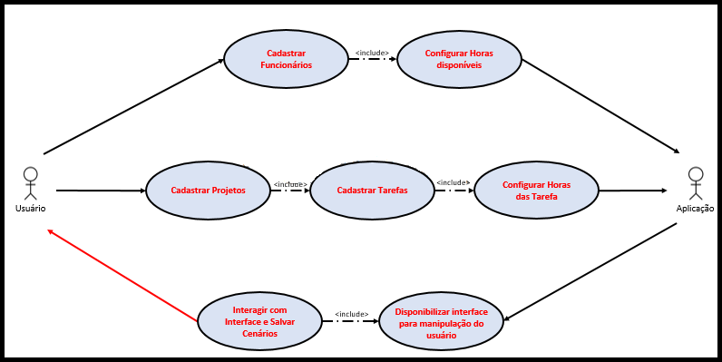
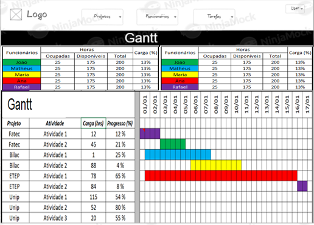
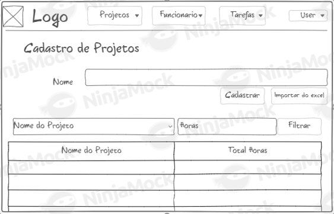

    
    

# 💥 **Equipe Bridges**💥

## Disciplinas e Professores 

Engenharia de Software - Profº Giuliano Bertoti  
Linguagem de Programação e Lab2 - Profª Adriana Jacinto  
Arquitetura de BD - Profº Emanuel Mineda  

## Equipe  

[Arthur Cardoso](https://gitlab.com/arthur_rinaldi00)  
[Bruna Gonçalves](https://gitlab.com/brunahsg)  
[Daniel Delgado](https://gitlab.com/DNLMR) - Product Owner  
[Sabrina Calado](https://gitlab.com/sabrinacalado) - Scrum Master  

## Link Utéis do Projeto  

[Documentações](https://gitlab.com/DNLMR/bridges/-/tree/sprint_04/docs)  
[Apresentações](https://gitlab.com/DNLMR/bridges/-/tree/sprint_04/apresentacoes)  

## Project Vision

A proposta do projeto é criar uma interface que permita o usuário cadastrar todos os aspectos de seu ambiente de desenvolvimento (pessoas, projetos, tarefas) fazendo com que por meio de uma interface pratica e interativa o usuário consiga elaborar e analisar cenários referente ao planejamento de seu dia-a-dia, orquestrando pessoas, projetos e horas disponíveis de desenvolvimento para potencializar suas entregas.   
Definimos nosso MVP (Minimum Viable Product) como sendo:  

> Permitir que o usuário cadastre todos os aspectos de seu ambiente de desenvolvimento (pessoas, projetos, tarefas) e permitir por meio de uma interface pratica e interativa (drag and drop) que o usuário consiga elaborar e analisar cenários referente ao planejamento de seus projetos e horas disponiveis de desenvolvimento.

## Requisitos Técnicos

- Python 3.7 - Linguagem principal  
- PyCharm e/ou Visual Studio Code - IDE  
- FrameWork Django 3 - interface WEB  
- MySQL - Banco de Dados  
- Conceitos do SCRUM - Norteador do Projeto  
- Zen of Python - boas práticas para o Projeto  

##  Epics / Requisitos do Sistema

| Funcionários | Projetos | Tarefas | Relações|
| :-----------:|:-------:|:--------:|:-------:|
Permitir o usuário cadastrar Funcionários e carga horária de trabalho | Permitir cadastrar Projetos para que em seguida sejam cadastradas Tarefas | Permitir cadastrar Tarefas (descrição, tempo) | Atribuir tarefas para um projeto;   Atribuir funcinários para uma tarefa;  Apresentar GAP's horas disponiveis x horas utilizadas

## Requisitos Funcionais

- Cadastrar Projetos, funcionários e tarefas;
- Autenticação de usuários;
- Relacionar tarefas x projetos;
- Relacionar funcionários x tarefas;
- Relacionar tarefas x calendário; 
- Calcular e exibir horas totais do projeto baseado na duração total das tarefas; 
- Calcular e exibir quantidade de horas disponíveis de cada funcionário.

## Requisitos Não Funcionais

- Sistema leve;
- Baixa manutenção;
- Interface simples.

## Backlog

|ID Requisito|Tarefa|Priorização|Descrição|Status|
|:------------:|:------:|:------------------:|:---------:|:------:|
|R001|Navegação e Interações|1|A aplicação deve conter as telas e funções para Cadastro/Consulta Tarefas, Projetos e Funcionários|Done|
|R002|Indicador de Carga de Trabalho por Funcionário|2| Um indicador que relaciona Horas Totais Disponíveis e Horas 'Ocupadas/Alocados' de cada funcionário deve ser disponibilizado para o usuário |Doing|
|R003|Gráfico de GANTT|3|O Gráfico de GANTT deve permitir o usuário atribuir tarefas para os funcionários e distribui-las na linha do tempo|Doing|
|R004|Segurança da Aplicação|4|Deve ser criado um método para assegurar a segurança da Aplicação (autenticação de usuário) |Doing|
|R005|Importação Excel|5|A interface deve permitir a importação de uma planilha de Excel para dentro da Aplicação|To Do|
|R006|Calendário|6| O calendário do Gráfico de GANNTT deve contemplar feriados e particularidades da cidade de SJC|SSDT*|
|R007|Matriz de Habilidades|7| Criar Matriz de Habilidade para os funcionários, fazendo com que seja possível identificar melhores candidatos para determinada tarefa/projeto|SSDT*|

'* SSDT- só se der tempo

## Diagrama Caso de Uso

    
    

   
## Wireframe

- #### Tela de login

    
    

  
- #### Tela com gráfico de gantt

    
    

  
- #### Tela de Padrão Cadastro/Consulta Entidade (Projeto, Funcionário, Tarefas)

    
    

